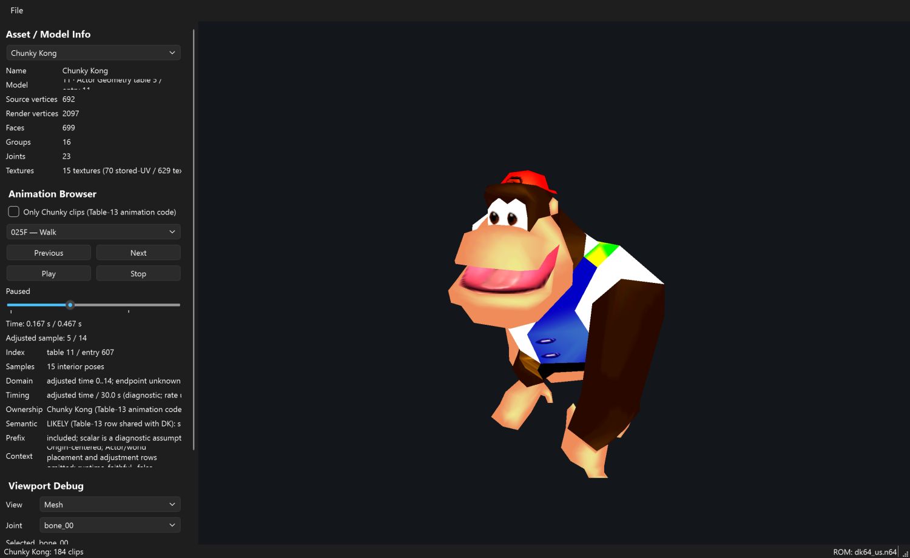

# DK64 Forge

DK64 Forge is an experimental desktop viewer and exporter for Donkey Kong 64 US revision 0.

- **Characters:** the five playable Kongs (Donkey Kong, Diddy, Tiny, Chunky and Lanky) as textured,
  skinned models with their weapons and instruments; plays their animations and exports static or
  animated glTF, which opens in Blender.
- **Models, Levels, Audio and Textures:** browse every actor, prop and map, play the music and
  sound effects, and export textures.



*The screenshot shows the program's output for illustration.* **No ROM and no game data file is included.** You need your own legally obtained
Donkey Kong 64 US revision 0 ROM. It is read locally and never modified or
uploaded.

## Run it (Windows)

1. Install [Python 3.12 or newer](https://www.python.org/downloads/) (tick "Add python.exe to PATH").
2. Download this repository as a ZIP (green **Code** button → **Download ZIP**) and unpack it, or clone it:
   `git clone https://github.com/marvelmaster/DK64-Forge`
3. Double-click `start_forge.bat`. On the first run it creates a `.venv` and installs
   `PySide6`, `PyOpenGL`, `numpy` and `lameenc` (MP3 export) from `requirements.txt`; afterwards it just starts the app.
4. In the app choose **File → Load ROM** and select your Donkey Kong 64 US ROM
   (`.z64`, `.n64` or `.v64`; the file name does not matter, the content is validated).

Manual start from the repository root:

```powershell
python -m venv .venv
.\.venv\Scripts\python.exe -m pip install -r requirements.txt
.\.venv\Scripts\python.exe -m dk64_forge
```

The first time you open each Kong, the app scans the ROM's animation table and caches a small
result file in `local_output/` (local, ROM-derived, never uploaded).
Nothing else needs to be downloaded or set up.

## Using the app

- The character selector switches between the five Kongs. The animation selector lists the
  Table-11 animations that fit the character's skeleton; **Only … clips** hides everything the
  character's own animation code never plays. Labels such as `Walk` are derived from the game's
  code and are not official names.
- The **variant** selector under the character shows the Kong with its **weapon drawn** (Coconut
  Shooter, Peanut Popguns, Grape Shooter, Feather Bow, Pineapple Launcher) or its **instrument model**
  (Diddy, Lanky, Tiny and Chunky). Weapons are part of each Kong model and follow the hand bones in every
  animation; the hand-state bits are the ones the game sets when the weapon is drawn.
- The viewport supports orbit, pan and zoom, mesh/skeleton views and animation playback.
- **Timing**: *Game rate* plays 30 adjusted units per second (observed for DK's Entry 4, a
  diagnostic assumption elsewhere), *Technical* plays one sample per second; the speed slider
  (0.1x–5.0x) scales both. **Mark Current as Reference** / **Go to Reference** jump back to a clip.
- **Viewport Debug** shows the selected joint's parent, current position, rest offset and the
  geometry it moves; the browser shows the root (bone 0) translation of the current frame.
- Start directly with a ROM: `.venv\Scripts\python.exe -m dk64_forge --rom C:\path\to\rom.z64`.
- **File → Export** writes the model, the current animation only (joints + clip, no mesh), or
  model plus animation as glTF. Keep the `.gltf`, `.bin` and any
  `textures/` folder together.

| Kong | Bones | Faces | Animations in the browser | Played by the Kong | Labelled |
|---|---|---|---|---|---|
| Donkey Kong | 25 | 704 | 183 | 94 | 76 |
| Diddy Kong | 37 | 678 | 175 | 103 | 83 |
| Tiny Kong | 39 | 744 | 165 | 95 | 68 |
| Chunky Kong | 23 | 699 | 184 | 98 | 76 |
| Lanky Kong | 21 | 704 | 171 | 92 | 66 |

### Models and Levels tabs

The **Models** tab lists every actor model (table 5, e.g. Rambi, enemies, NPCs) and every prop
(table 4, named by the ROM itself, e.g. `torches`); the **Levels** tab lists the map geometry
(table 1, e.g. Japes). Each entry is shown as a static, textured mesh with its vertex colours and
can be exported as a single binary glTF (**Export static GLB...**). Animated props and actors are
shown in their rest pose; lighting and the colour combiner are approximated.
Details: [docs/models.md](docs/models.md).

### Audio tab

The **Audio** tab plays the 174 songs and 1,126 sound effects and exports WAV or MP3. Songs are rendered
from the game's compressed MIDI and instrument bank with the game's own reverb settings; sound effects
use the game's samples, decoded exactly. Details: [docs/audio.md](docs/audio.md).

### Textures tab

The **Textures** tab is a bank of the ROM's 6,011 geometry textures (table 25), with search, filters,
a pixel preview and PNG export. The ROM stores neither formats nor names: Forge reads them from the
display lists of every actor, prop and map that uses a texture (about 3,800 decode this way), and
derives each name from its first user. Details: [docs/textures.md](docs/textures.md).

## Project layout

- `dk64_forge/` – the application (window, viewport, export, ROM session, Models/Levels/Audio/Textures tabs).
- `dk64_forge/core/` – the DK64 core: ROM tables and decoding (`rom_model`), textures/hilite (`texgen`),
  skeleton, animation tables, census and labels, pose reconstruction and the Entry-4 reference clip,
  the texture bank (`texture_bank`), the generic static mesh decoder (`mesh_decoder`) and audio
  (`audio_rom`, `audio_sequence`, `audio_render`, `audio_reverb`, `audio_export`, `audio_names`).
  See `dk64_forge/core/__init__.py` for the module list.
- `start_forge.bat`, `requirements.txt` – launcher and dependencies.

## Limitations

Experimental research tool, not a runtime-faithful reproduction. Animation is supported for the playable
models, their weapon state and instrument models (no low-poly variants, no DK bongos); other actors, props and maps are static. Lighting is not
modelled (shirts and shoes render flat white), animation timing is a browser convenience
(30 units/s) for all clips except the reference clip of Donkey Kong, and adjustment rows and
world placement are omitted. The exported textures use a fixed front camera for the
view-dependent highlight faces. In the Models and Levels tabs lighting is approximated and map
objects are not placed. Songs are rendered by Forge (no chorus or mid-note pitch bends), and sound
effects play at their sample's own pitch and volume.

## Legal and license

The source code is released under the [MIT License](LICENSE). Donkey Kong 64 and its
characters belong to their respective owners; this is an unofficial, non-commercial research
tool. The viewport layout and the audio player/renderer are adapted from JFG Forge
([license](licenses/JFG_Forge_MIT.txt)); other sources are listed in [licenses/THIRD_PARTY.md](licenses/THIRD_PARTY.md).
